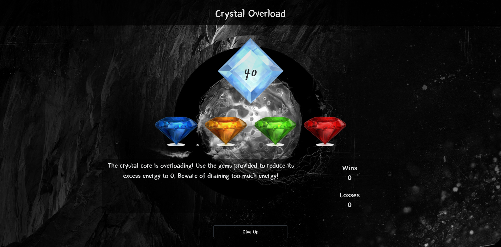

# Crystal Game

The crystal core is overloading! Use the gems to syphon power from it until it stabilizes. Be care not to overdraw the energy! If the power level drops below 0, the crystal core will be unsalvageable.

## Getting Started

Open up the [project link](https://robertshaw87.github.io/Crystal-Game/) and you should be able to see the example webpage shown below:



Simply click one of the gems to reduce the power of the crystal. Your goal is to reduce the crystal to 0 power without letting it fall into the negatives. Beware! The gems will syphon a random amount of power each time you reset!
### Prerequisites

You need to have a modern browser able to handle html5, javascript, and css. 

Some popular browsers are:
```
Google Chrome
Mozilla Firefox
Safari
Opera
Edge
```

### Installing

No installation needed! Just open the page in your preferred browser.

### Behind the Scenes

There are messages logged to the console if you want to see some of the debugging messages. Or cheat.

## Built With

* Html

* CSS

* [Javascript](https://www.javascript.com/) - The scripting Language used

* [BootstrapCDN v4.1.0](https://getbootstrap.com/docs/4.1/getting-started/introduction/) - The web framework used

* [jQuery v3.3.1](http://jquery.com/) - Java library for DOM and CSS manipulation

* [Google Fonts](https://fonts.google.com/) - Font repository

## Challenges

While I didn't have much trouble with the logic and dynamic generation during the creation of this app, I did find a few hiccups in styling. I layered too many animations on top of each other and the end result is jumpy and twitchy instead of smooth. I am quite satisfied with the actual feel of the page though.

## Authors

* **Robert Shaw** - *Initial work* - [robertshaw87](https://github.com/robertshaw87)
